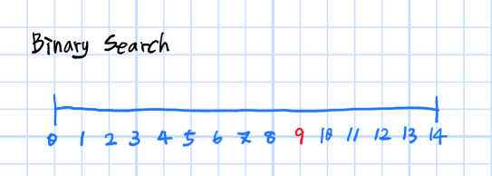
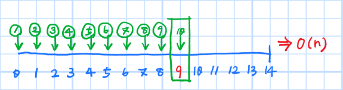
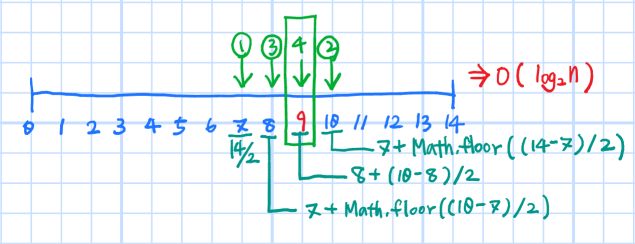
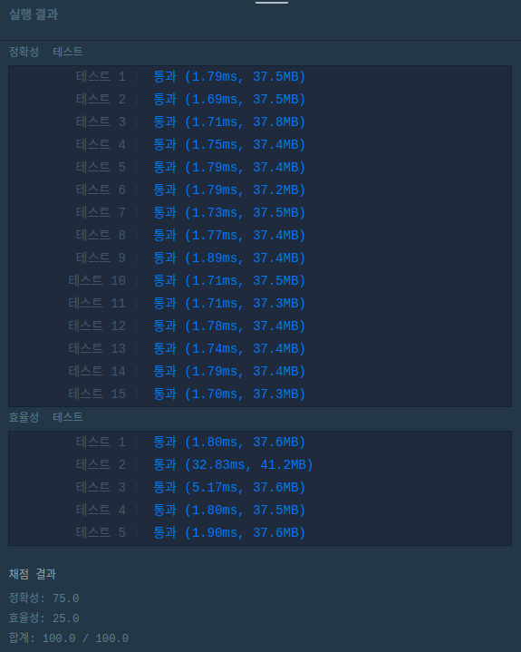

요새 알고리즘 풀이를 다시 하고 있고 예전에 풀었던 것들도 따로 정리를 해놓지 않다 보니 쉽게 잊혀버려서 복습 겸 정리를 하려고 한다.

지금은 기본적인 알고리즘부터 풀고 있는데, 좀 익숙해지면 백준에서 예전에 풀었던 문제들부터 JS로 다시 풀어봐야겠다 :)

백준에서 JS를 지원하지 않는다고 생각했는데 다시 보니 node.js가 있었다!

작년에는 node.js가 JS의 런타임인 것도 모른 채 JavaScript가 없구나 하고 넘어갔었기 때문에 새삼 발전한 게 느껴져서 웃기고 신기하다.


# 프로그래머스 이분탐색 [예산](https://programmers.co.kr/learn/courses/30/lessons/43237)

기본 중에 기본인 binary search 문제이다.

최근 코딩테스트에서 binary search를 못 풀고 나왔던 게 너무 아쉬워서 이것부터 시작했다😢


## 이분탐색 Binary Search ?

이분탐색은 단어의 뜻 그대로 반 씩 나눠가면서 탐색하는 것을 뜻한다.

찾고자 하는 값의 범위를 반 씩 줄여나감으로써 효율적으로 탐색하는 방법이다.

보통 탐색으로 찾고자 하는 값이 하나이고 순서를 가지고 있는 경우에 사용한다.


그림으로 설명해보자면,



위 그림과 같이 0에서부터 14까지의 숫자 중 9를 찾는다고 가정해보자.


처음부터 찾는다면 10번을 찾아야 한다.



지금은 9를 찾는 것이기 때문에 10번 만에 찾을 수 있었지만 찾고자 하는 값이 14라면? 0~14까지의 수 중에서 찾는 것이 아니라 n까지의 수 중 n을 찾는다면?

시간복잡도는 O(n)이 될 것 이다.


처음부터 찾는 것이 아니라 중간부터 범위를 반씩 줄여나가면서 찾는다면?



10번의 반도 안되는 4번 만에 원하는 값을 찾을 수 있다.

이분탐색은 탐색의 범위가 매 번 반으로 줄기 때문에 O(n)의 시간복잡도를 가진다.


> ## 문제
>
> 국가의 역할 중 하나는 여러 지방의 예산요청을 심사하여 국가의 예산을 분배하는 것입니다. 국가예산의 총액은 미리 정해져 있어서 모든 예산요청을 배정해 주기는 어려울 수도 있습니다. 그래서 정해진 총액 이하에서 가능한 한 최대의 총 예산을 다음과 같은 방법으로 배정합니다.
>
> 
>
> **1.** 모든 요청이 배정될 수 있는 경우에는 요청한 금액을 그대로 배정합니다.
>
> **2.** 모든 요청이 배정될 수 없는 경우에는 특정한 정수 상한액을 계산하여 그 이상인 예산요청에는 모두 상한액을 배정합니다.
>
>    상한액 이하의 예산요청에 대해서는 요청한 금액을 그대로 배정합니다.
>
> 
>
> 예를 들어, 전체 국가예산이 485이고 4개 지방의 예산요청이 각각 120, 110, 140, 150일 때, 상한액을 127로 잡으면 위의 요청들에 대해서 각각 120, 110, 127, 127을 배정하고 그 합이 484로 가능한 최대가 됩니다.
>
> 각 지방에서 요청하는 예산이 담긴 배열 budgets과 총 예산 M이 매개변수로 주어질 때, 위의 조건을 모두 만족하는 상한액을 return 하도록 solution 함수를 작성해주세요.


## 입출력 예제

| budgets                    | M    | return |
| -------------------------- | ---- | ------ |
| [120, 110, 140, 150]       | 485  | 127    |
| [9, 8, 5, 6, 7]            | 5    | 1      |
| [1000, 1000, 1000, 1, 100] | 500  | 133    |


## 풀이

while문을 사용하는 코드는 탈출 조건을 잘못 작성했다가는 무한 loop를 타기 때문에 탈출조건 작성이 **아주 매우** 중요하다.

탈출조건과 관련한 수도코드를 잘 작성해야 한다.


### 1. 수도 코드

minBudget = 0; maxBudget = M;

* binary search로 예산을 찾음
  * nowBudget = minBudget + Math.floor((maxBudget - minBudget) / 2);
  * 탈출 조건 확인
    * 같은 budget이 두 번 나올 경우 그 budget이 최선인 것으로 판단. => 범위를 좁혀나가며 탐색하기 때문에 이전 결과의 budget과 현 budget이 같을 경우를 최선의 budget으로 판단

* if(예산 계산 결과 === 0)
  * result = nowBudget;
  * break;
* else if(예산 계산 결과 < 0)
  * maxBudget = nowBudget;
  * preBudget = nowB;

* else
  * minBudget = nowBudget;
  * preBudget = nowB;


### 2. 코드

```js
function solution(budgets, M) {
  let result = 0;
  let sumBudgets = budgets.reduce((acc, val) => {
    if (result < val) {
      result = val;
    }
    return acc + val;
  }, 0);

  if (M - sumBudgets < 0) {
    // 모든 요청이 배정될 수 없음
    let minBudget = 0;
    let maxBudget = M;
    let preBudget = 0;

    while (minBudget >= 0 && maxBudget <= M) {
      //탈출조건: 같은 budget이 두 번 나올 경우
      let nowBudget = minBudget + Math.floor((maxBudget - minBudget) / 2);
      if (nowBudget === preBudget) {
        result = nowBudget;
        break;
      }

      let calculateBudget =
        M -
        budgets.reduce((acc, val) => {
          if (val > nowBudget) {
            return acc + nowBudget;
          } else {
            return acc + val;
          }
        }, 0);

      if (calculateBudget === 0) {
        result = nowBudget;
        break;
      } else if (calculateBudget < 0) {
        maxBudget = nowBudget;
        preBudget = nowBudget;
      } else {
        minBudget = nowBudget;
        preBudget = nowBudget;
      }
    }
  }

  return result;
}
```


## 채점 결과



채점 결과 잘 통과했다! 뿌듯