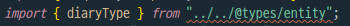
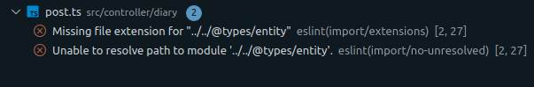
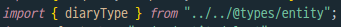
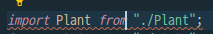
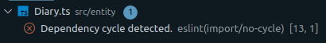
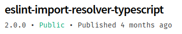
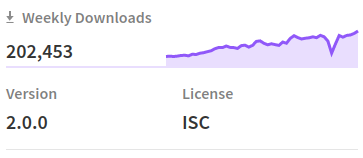

# Error

현재 프로젝트에서 TS(Typescript)와 TypeOrm을 사용하고 있는데 entity의 type을 사용해야 돼서 `index.d.ts`를 만들었다.


`index.d.ts`에 `interface`로 타입생성하고 `export`까지는 잘 했는데 `import`과정에서 eslint 오류가 났다..!

얘도 index니까 여타 index처럼 디렉토리만 쓰면 어디 걸리는 곳 없이 잘 불러올거라고 생각했는데 오산이었나보다.

(js는 기본적으로 디렉토리만 적어서 `import`하면 그 디렉토리 내의 `index.js`를 불러온다 -> `import test from "./test/index.js"`와 `import test from "./test"`가 같음)

eslint는 유명한 airbnb룰(+a.. -a?)을 사용하기로 팀원들과 약속했고 import/extensions rules에 "d.ts"도 추가해주고 settings의 import/resolver의 node에도 "d.ts"를 추가해줬는데도 오류가 생겼다.


아래는 `.eslintrc.json`파일

```js
{
  "env": {
    "commonjs": false,
    "es6": true,
    "node": true
  },
  "extends": ["airbnb-base"],
  "globals": {
    "Atomics": "readonly",
    "SharedArrayBuffer": "readonly"
  },
  "parser": "@typescript-eslint/parser",
  "parserOptions": {
    "project": "./tsconfig.json",
    "ecmaVersion": 2018
  },
  "plugins": ["@typescript-eslint"],
  "rules": {
    "no-console": 0,
    "no-unused-vars": 0,
    "quotes": ["error", "double"],
    "object-curly-newline": ["error", { "multiline": true, "consistent": true }],
    "operator-linebreak": ["error", "after", { "overrides": { "?": "before", ":": "before" } }],
    "import/extensions": [
      "error",
      "ignorePackages",
      {
        "js": "never",
        "jsx": "never",
        "ts": "never",
        "tsx": "never",
        "json": "never",
        "d.ts": "never"
      }
    ]
  },
  "settings": {
    "import/resolver": {
      "node": {
        "extensions": [".js", ".jsx", ".ts", ".tsx", "d.ts"]
      }
    }
  }
}

```


아래는 lint오류가 발생한 `import`문.

```js
import { diaryType } from "../../@types/entity";
```



코드에서 보면 위 이미지와 같이 밑줄이 생긴다(에러표시).


다음은 오류 내용

```
Missing file extenstion for "../../@types/entity" eslint(import/extensions)
Unable to resolve path to module '../../@types/entity'. eslint(import/no-unresolved)
```




# Handling

https://www.npmjs.com/package/eslint-import-resolver-typescript

위 모듈 설치


1. installation

```
# npm 
npm i -D eslint-plugin-import @typescript-eslint/parser eslint-import-resolver-typescript
 
# yarn 
yarn add -D eslint-plugin-import @typescript-eslint/parser eslint-import-resolver-typescript
```


2. `.eslintrc`파일에 다음 내용 추가하기

```js
{
  "plugins": ["import"],
  "rules": {
    // turn on errors for missing imports
    "import/no-unresolved": "error"
  },
  "settings": {
    "import/parsers": {
      "@typescript-eslint/parser": [".ts", ".tsx"]
    },
    "import/resolver": {
      // 아래부터는 자기 코드의 특징에 맞는 설정을 골라서 추가하면 된다.
        
      // 1. use <root>/tsconfig.json
      "typescript": {
        "alwaysTryTypes": true // always try to resolve types under `<roo/>@types` directory even it doesn't contain any source code, like `@types/unist`
      },
 
      // 2. use <root>/path/to/folder/tsconfig.json
      "typescript": {
        "directory": "./path/to/folder"
      },
 
      // 3. Multiple tsconfigs (Useful for monorepos)
 
      // 3-1. use a glob pattern
      "typescript": {
        "directory": "./packages/*/tsconfig.json"
      },
 
      // 3-2. use an array
      "typescript": {
        "directory": [
          "./packages/module-a/tsconfig.json",
          "./packages/module-b/tsconfig.json"
        ]
      },
 
      // 3-3. use an array of glob patterns
      "typescript": {
        "directory": [
          "./packages/*/tsconfig.json",
          "./other-packages/*/tsconfig.json"
        ]
      }
    }
  }
}
```


이걸 하니까 짜잔!!



에러가 해결됐다!


하지만 여기서 다른 **error**가 발생.. lint가 사람잡네~~!!





```
Dependency cycle detected. eslint(import/no-cycle)
```

> https://github.com/benmosher/eslint-plugin-import/blob/v2.20.1/docs/rules/no-cycle.md

위 링크에서 해당 rule의 내용을 살펴보니 `import`를 연쇄적으로 하면 발생하는 lint오류였다.

이 rule을 사용하면 좋겠지만 지금은 시간이 없으니 해당 룰을 disable하기로 결정했다.


"import/no-cycle"을 비활성화 하는 방법

`.eslintrc.json`에 아래 내용을 추가한다.

```js
{
  ... ,
  "rules": {
    ... ,
    "import/no-cycle": "off" // 추가해야할 코드
  },
}
```


---

나 말고도 많은 사람들이 같은 에러를 겪었나보다.

이 모듈이 published된지 4달밖에 안됐는데 Weekly Downloads가 벌써 202,453명이나 되네.

 


지금은 주어진 시간이 적어서 아예 모듈별 타입만들기는 못하지만 나중에는 모듈 별 타입을 만들어서 따로 import 없이 사용할 수 있게 할 것이다.

> 모듈의 `index.d.ts`만들어서 사용하기 레퍼런스
>
> https://www.slideshare.net/gloridea/dts-74589285