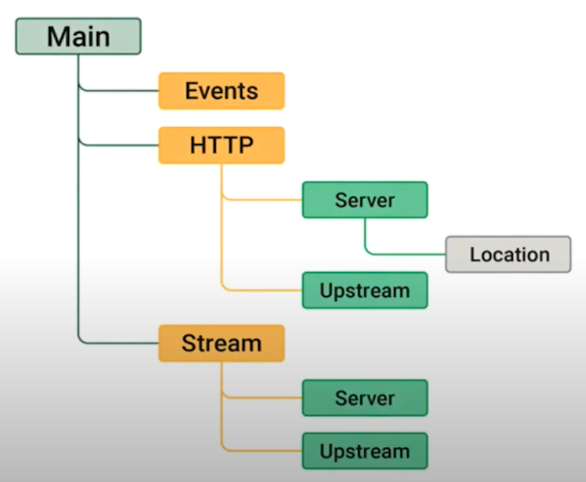

# Configuration Contexts

- Configuration파일: Context, Directive의 조합

## File Location

- Main File: 기본 위치
  ```
  /etc/nginx/nginx.conf
  ```
- Includes: nginx 인스턴스를 구성하는 모든 Includes 설정파일
  ```
  /etc/nginx/conf.d/*.conf
  ```

## Context



Each Nginx Configuration has:

- One Main context
- One HTTP context


## Directives 지시어

- Directive - a statement that controls NGINX Behavior
  - 주어진 NGINX 동작을 제어하는 단일 명령문
- Block - a group of directives in a context

```shell
Server { # Start of Server Block
  listen 80; # Listen Directive
  root /usr/share/nginx/html; # Root Directive
} # End of Server Block
```

## Example

1. in `/etc/nginx/nginx.conf`

   ```Shell
   user       www www;  ## Default: nobody
   worker_processes  5;  ## Default: 1
   error_log  logs/error.log;
   pid        logs/nginx.pid;
   worker_rlimit_nofile 8192;

   events {
     worker_connections  4096;  ## Default: 1024
     ## 높은 성능을 얻으려면 매개 변수를 조정해야 함.
   }

   http {
     include    conf/mime.types;
     default_type application/octet-stream;

     log_format   main '$remote_addr - $remote_user [$time_local]  $status '
       '"$request" $body_bytes_sent "$http_referer" '
       '"$http_user_agent" "$http_x_forwarded_for"';

     access_log   logs/access.log  main;

     sendfile     on;

     include /etc/nginx/conf.d/*.conf
     ## /etc/nginx/conf.d/ 디렉토리의 .conf로 끝나는 모든 파일을 include
   }
   ```

2. in `/etc/nginx/conf.d/default.conf`

   ```
   server: {
     listen      80;
     server_name localhost;

     location / {
       root  /usr/share/nginx/html;
       index index.html  index.htm;
     }
   }
   ```

   | 명령어는 nginx.com 에서 더 상세한 예제 확인할 수 있음.

3. localhost의 default access file(`/usr/share/nginx/html`) 받아올 수 있음

   ```zsh
   $ curl localhost:80
   $ curl localhost
   ```

4. in `/etc/nginx/conf.d/web.conf`
   ```
   server {
     listen 9001;

     location: {
       return 200 "You have reached Application 1\n";
       ## 경로를 적지 않고 status와 message를 보낼 수도 있음.
     }
   }

   server {
     listen 9002;

     location / {
       return 200 "You have reached Application 2\n";
     }
   }
   ```

5. 
   ```zsh
   $ curl localhost:9001
   You have reached Application 1
   $ curl localhost:9002
   You have reached Application 2
   ```
