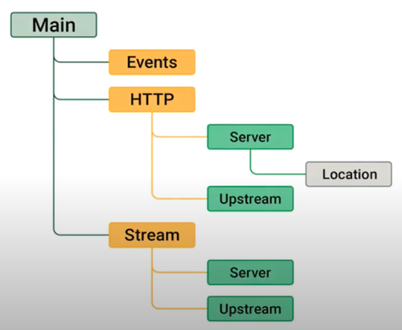

# Configuration Contexts

graph LR
  main[Main] --> events[Events]
  main --> http[HTTP]
  http --> server[Server]
  server --> location[Location]
  http --> upstream[Upstream]
  main --> stream[Stream]
  stream --> server2[Server]
  stream --> upstream2[Upstream]

Each Nginx Configuration has:
* One Main context(Highest level directives)
  * Number of worker processes
  * Linux username
  * Process ID (PID)
  * Log file Location
* One HTTP context

